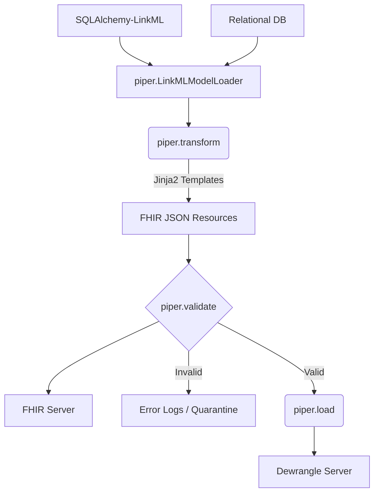

# Piper: FHIR ETL & Validation Engine

**Internal Project Name:** piper  
**Status:** Draft / In-Progress

---

## 1. Project Overview

| Attribute | Description |
|-----------|-------------|
| **Problem** | High-volume relational data must be transformed into a single FHIR model for cross-study interoperability. |
| **Primary Goals** | Extract from RDB, Transform via Jinja, Validate against NCPI IG, Load to Dewrangle. |
| **Tech Stack** | Python 3.x, SQLAlchemy, Jinja2, LinkML. |
| **Orchestration** | AWS Airflow, S3. |

---

## 2. Architectural Design

The system follows a modular pipeline. Each piper sub-command is designed to be atomic for both CLI usage and Airflow task isolation.

### Key Components

**`piper.transform`** — The core projection engine. It maps SQLAlchemy classes to Jinja templates using a configuration-driven Jinja Mapper.

**`piper.validate`** — A quality gate that POSTs resources to a FHIR server's `$validate` endpoint to ensure NCPI FHIR IG compliance.

**`piper.load`** — Handles the authenticated transmission of validated resources to the Dewrangle API.

---

## 3. Data Model & Tooling

| Component | Description |
|-----------|-------------|
| **LinkML Data Model** | Defines the source-of-truth SQLAlchemy classes used by Jinja for projection. |
| **Jinja Templates** | One `.j2` file per FHIR Resource level (e.g., `Patient.j2`, `Observation.j2`). |
| **Jinja Mapper** | A lookup table handling cases where one SQLAlchemy class feeds multiple templates. |
| **Resource List** | An optional filter (JSON/YAML) to scope the ETL run. |

---

## 4. Functional Specifications

### User Stories

**Story 1 — Authoring:** As an ETL author, I can validate a single template's output against a FHIR server during development.

**Story 2 — Operations:** As a data engineer, I can manually trigger a full Transform → Validate → Load cycle via the CLI.

**Story 3 — Automation:** As a system, the tool integrates into Airflow DAGs, utilizing S3 as a staging area between steps.

---

## 5. Roadmap & TBDs

### Non-Functional Requirements

| Area | Requirement |
|------|-------------|
| **Scalability** | Determine parallel processing limits for Jinja rendering. |
| **Security** | Implementation of AWS Secrets Manager for DB/API credentials. |
| **Error Handling** | Define "Stop-on-error" vs. "Quarantine-and-continue" thresholds. |

### Risks & Open Questions

1. Performance overhead of network-based FHIR validation for large datasets.
2. Strategy for handling circular references in FHIR resources during the load phase.
3. Does it make sense to separate the Jinja template into its own repo to support different transforms (i.e. different source models or different IGs, etc.)
